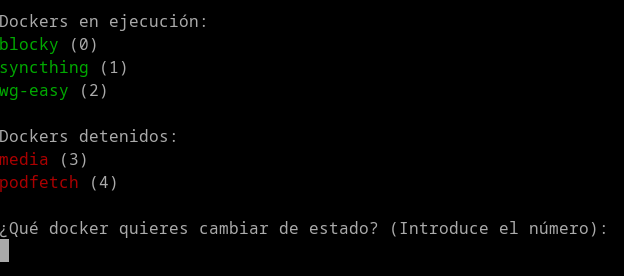

# dk
Create dockers that you have saved in 2 steps. 
List your dockers and their ports. List your images by creation date

## Install

```
sudo curl -L https://raw.githubusercontent.com/uGeek/dk/master/dk \
          -o /usr/bin/dk && sudo chmod +x /usr/bin/dk
```


## Help
```

Modo de empleo: dk [OPCIONES]

dk   m                   -> Cambiar estado de dockers mediante menú (si añades r o p despues del número de docker, reinicia o muestra puertos)
dk   mp                  -> Comando m, pero con prompt en modo bucle infinito
dk   mf                  -> Cambiar estado de dockers mediante menú. Solo dockers que se indiquen. Ejemplo: dk mf caddy jellyfin
dk   mfp                 -> Comando mf, pero con prompt en modo bucle infinito
dk   mft                 -> Comando mf pero pudiendo determinal el tiempo máximo que estará corriendo el docker
dk   mftp                -> Comando mft, pero con pront y pudiendo determinal el tiempo máximo de duración que estará corriendo el docker
dk   cli                 -> Menú para crear un contendor guardado con docker cli
dk   cliv                -> Menú para ver un contendor guardado con docker o docker-compose (show, see)
dk   a                   -> Automontaje de todos los dockers de un grupo (add)
dk   dc                  -> Montar un docker-compose (docker-compose up -d)
dk   dcfu                -> Montar un docker-compose en un archivo (file) desde el directorio dk
dk   dcfd                -> Detener un docker-compose en un archivo (file) desde el directorio dk
dk   dcfua               -> Montar el primer resultado un docker-compose en un archivo (file) desde el directorio dk. Primer resultado por nombre dk   dcfla               -> Ver logs del primer resultado un docker-compose en un archivo (file) desde el directorio dk. Primer resultado por nombre
dk   dcfda               -> Detener el primer resultado un docker-compose en un archivo (file) desde el directorio dk. Primer resultado por nombredk   dcfpa               -> Actualizar imagen del docker-compose en un archivo (file) desde el directorio dk. Primer resultado por nombre
dk   dcfpa               -> Actutualizar docker-compose pull
dk   dcr                 -> Montar un docker-compose guardado (remote)
dk   dcd                 -> Detener con docker-compose y volumenes (docker-compose down)
dk   dcdr                -> Detener con docker-compose guardado (remote)
dk   dcvl                -> Eliminar con docker-compose y volumenes (docker-compose down -v)
dk   dcv                 -> Ver un docker-compose y editarlo
dk   dccp                -> Copiar un docker-compose existente, por otro de otro nombre
dk   dcl                 -> Docker-Compose logs
dk   dcrm                -> Eliminar docker-compose detenidos
dk   dcrrm               -> Eliminar plantilla en directorio dk, docker-compose
dk   dcn                 -> Guarda un nuevo docker-compose (new)
dk   clin                -> Guarda un nuevo docker
dk   i                   -> Imagenes listadas por creación (image) 20 últimas
dk   iall                -> Imagenes listadas por creación (image)
dk   rc                  -> Camviar nombre contenedor (rename docker)
dk   ri                  -> Cambiar nombre de imagen (rename image)
dk   u, up, start        -> Lista dockers con su número para iniciar (up)
dk   ut                  -> Levantar docker y que esté corriendo durante un tiempo establecido. Ejems:  dk ut 30m flatnotes , dk ut 5h media jellyfin   (Permite hasta 9 dockers)
dk   d, down, stop       -> Lista dockers corriendo, con su número para detener (down)
dk   d                   -> Detener todos los dockers que empiecen por el nombre... Ejem: dk dn im , dentrá todos los dockers que su nombre empieza por im, como immich
dk   r, restart          -> Reiniciando docker
dk   d -a, stop -a, ...  -> Detener todos los contenedores
dk   e, exec             -> Entrar dentro del contenedor
dk   eb, execb           -> Entrar dentro del contenedor con bash
dk   ip                  -> Conoce la ip de un docker
dk   ls ip, ip -a        -> Listar todas las ip's
dk   list ip             -> Listar todas las ip's de un modo distinto
dk   net, red            -> Listar todas las redes
dk   ls, ps              -> Dockers que están corriendo y sus puertos (list)
dk   lsp, psp            -> Dockers que están corriendo y sus puertos mostrando IP del servidor, añadido en la variable IP= del dk.conf
dk   ls -a, ps -a        -> Todos los Dockers disponibles (list all)
dk   st, store           -> Descarga Dockers de la store de dk
dk   rm                  -> Lista contenedores con su número para ser borrado (remove)
dk   drm                 -> Lista contenedores con su número para ser detenido y borrado (down and remove)
dk   rmi                 -> Lista imagenes con su número para ser borradas (remove image)
dk   b                   -> Construir una imágen a partir de un Dockerfile
dk   c                   -> Crear un docker a partir de una imagen
dk   save                -> Exportar imagen en el directorio actual
dk   load                -> Cargar Imagen del directorio actual
dk   sload               -> Buscar imagen del directorio actual, filtrando por palabra
dk   l, log              -> Lista contendores con su número, para ver los logs
dk   s, stats            -> Ver consumo de cpu, memoria,... de todos los contenedores
dk   sp, statsp          -> Ver consumo de cpu, memoria (porcentaje),... de todos los contenedores
dk   s c, stats c        -> Lista contenedores con su número para ver el consumo de cpu, memoria,...
dk   ss, stats sort      -> Ordena contenedores por cpu, memoria, ...
dk   p, prune            -> Borrar todos los Contenedores, imágenes, redes, que esten detenidos
dk   install ubuntu      -> Instalalar Docker y docker-compose en Ubuntu
dk   install debian      -> Instalalar Docker y docker-compose en Debian
dk   install armhf       -> Instalalar Docker y docker-compose en armhf (Raspberry)
dk   install arm64       -> Instalalar Docker y docker-compose en arm64
dk   install             -> Instalalar Docker y docker-compose para derivadas de Debian desde los repositorios
dk   not  [server]       -> Enviar notificaciones de contenedores que se levanten o detengan
dk   prompt              -> Utilizar comandos en bucle con un prompt
dk   killall             -> Detener todos los procesos que corren en sugundo plano de dk
dk  -h, h, --help        -> Ayuda (help)


  Ejemplos:

    dk u                  ->  Iniciar contenedor
    dk u web              ->  Iniciar contenedor, muestra lista filtrada por web

   Esta opción de filtrado funciona con dentener contenedores, listar imágenes, redes,...

    dk b                  ->  Construir un Dockerfile
    dk b ugeek/webdav:arm ->  Construir un Dockerfile con el nombre ugeek/webdav:arm

-------------------------
Integración con dockcheck
-------------------------
dk -install                        -> Clonar el repositorio de dockcheck para funcionar con dk


dk [OPTION] [part of name to filter]
------------------------------------
dk -h                              ->  Ayuda de dockcheck
dk -a navidrome                    ->  Actualiza navidrome
dk -y -d 10 -e nextcloud,heimdall  ->  Actualización automática de imagen +10 dias,
                                       excluyendo nextcloud,heimdall
dk -d 10 -s                        ->  Interacción usuario para actualizar todas las imagenes
                                       (incluidas imágenes las detenidas).


dk v2.0 25/12/2023
 Copyright (C) 2020 Angel. uGeek
 ugeekpodcast@gmail.com
```

## Comando en cron para notificaciones
Monitorización cada 2 minutos de los dockers en mi raspberry **rp4** y vps **vps**, **desde mi raspberry**.

En este ejemplo, estoy utilizando las notificaciones con el script para notificar en matrix. `| matrix -`

```
*/2 * * * * NOT=$(echo $(dk not rp4)) ; if [ "" != "$NOT" ]; then echo "$NOT" | matrix - ; fi
*/2 * * * * NOTREMOTO=$(echo "$(ssh -t  vps "dk not vps")") ; if [ "" != "$NOTREMOTO" ]; then echo "$NOTREMOTO" | matrix - ; fi
```

## Forzar la última actualización

Borra el archivo **last.log** y ejecuta cualquier comando **dk**.

```
rm ~/.config/dk/last.log 
```

## Menú para detener o iniciar dockers




## Integración de dockcheck

Integración del proyecto [dockcheck](https://github.com/mag37/dockcheck) instalandolo con el comando:

```
dk -install
```

Mira las opciones de dockcheck con:

```
dk -h
```


## Contact

If you want to contact me you can reach me at https://ugeek.github.io.

## License

This project uses the following license: [MIT License](https://choosealicense.com/licenses/mit/).
